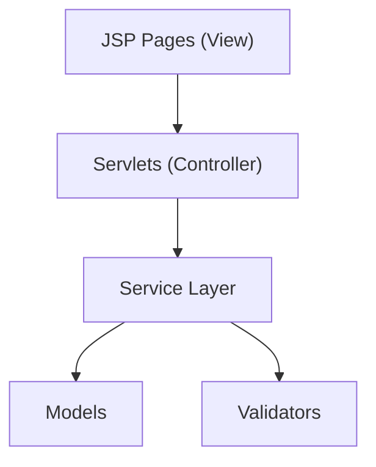
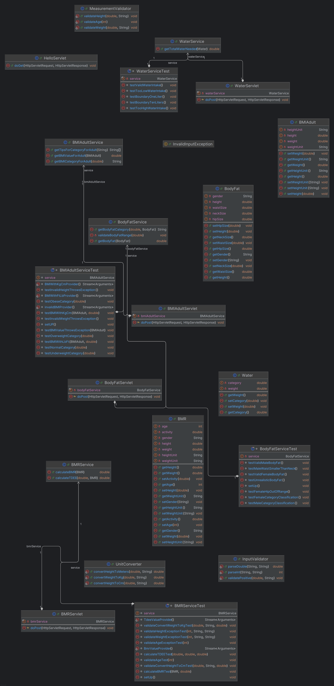

<p align="center">  </p>

<h1 align="center">⚕️ BMI Health – Multi-Health Calculator Web App</h1> <p align="center">A modern JSP + Servlet web application providing BMI, BMR, TDEE, Body Fat %, and Water Intake Calculations.</p>

## Badges

<!-- Language & Tech -->


<!-- Build & Tooling -->


<!-- Project Info -->


<!-- Environment -->


## 📌Overview

TBMI Health is a fully-functional JSP/Servlet-based health calculator web application.
It includes calculators for:

- BMI (Body Mass Index)

- BMR (Basal Metabolic Rate)

- TDEE (Total Daily Energy Expenditure)

- Body Fat Percentage (US Navy method)

- Daily Water Intake Calculator

The app follows a professional MVC architecture and includes:

✔ Model classes<br>
✔ Service layer<br>
✔ Input validation<br>
✔ Exception handling<br>
✔ Responsive UI<br>
✔ JUnit5 unit tests<br>

## ⚙️ Features

### 🧮 BMI Calculator
- Uses metric & imperial units
- Provides BMI category + tailored health tips
- Input validation & error handling

### 🔥 BMR & TDEE Calculator
- Add / Update / Delete books  
- Search by title, author, subject, ISBN  
- Track availability  

### 🧑‍🤝‍🧑 Borrower Management
- Uses Mifflin–St Jeor equation
- Supports activity levels
- Calculates daily caloric needs

### 💪 Body Fat % Calculator (U.S. Navy Formula)
- Male + Female formulas
- Instant body fat category
- Full explanation & ranges

### 💧 Water Intake Calculator
- Weight-based formula
- Activity adjustments
- Clean UI display 

### 🎨 Modern UI
- Navbar + Mobile hamburger
- Cards layout
- Fully responsive 


## 🏗️ Technologies Used

| Layer    | Technologies                 |
| -------- | ---------------------------- |
| Frontend | HTML, CSS, JSP               |
| Backend  | Java Servlets, Service Layer |
| Testing  | JUnit5       |
| Build    | Maven                        |
| Server   | Apache Tomcat 9/10           |
| Tools    | IntelliJ IDEA                |

## 🧩 Architecture Diagram (Mermaid)



## Project Structure

```
src/
└── main/
    ├── java/
    │   └── com.github.joel003
    │       ├── controller/   (Servlets)
    │       ├── service/      (Business logic)
    │       ├── model/        (POJOs)
    │       ├── util/         (Validators)
    │       └── exception/    (Custom exceptions)
    │
    ├── resources/
    │
    └── webapp/
        ├── css/
        ├── javascript/
        ├── images/
        ├── bmi-adult.jsp
        ├── bmr.jsp
        ├── bodyfat.jsp
        ├── water.jsp
        └── index.jsp

└── test/
    └── java/
        ├── BMIAdultServiceTest.java
        ├── BMRServiceTest.java
        └── InputValidatorTest.java

```

## 🚀 Installation & Setup

### 1️⃣ Clone the repository
```bash
git clone https://github.com/joel-003/BMI-Health-App.git
cd BMI-Health-App
```

### 2️⃣ Open in IntelliJ

- File → Open → select project folder
- IntelliJ will auto-import Maven dependencies

### 3️⃣ Configure Tomcat
- Run → Edit Configurations → Add New → Tomcat Local
- Set deployment to:
```
Artifacts → BMI-Health-App:war exploded
```

### 4️⃣ Run the project
Start Tomcat.
```
http://localhost:9090/BMI-Health-App/

```

## 🧪 Unit Testing (JUnit5)

### ✔ Tested Modules

| Test Suite          | Coverage                      |
| ------------------- | ----------------------------- |
| BMIAdultServiceTest | BMI formula + categories      |
| BMRServiceTest      | BMR & TDEE calculations       |
| BodyFatServiceTest  | Navy method accuracy          |
| InputValidatorTest  | parseDouble, validation rules |

### Run all tests:
```
mvn test

```

## ▶️ Servlet Endpoints

| Page     | Servlet         | URL             |
| -------- | --------------- | --------------- |
| BMI      | BMIAdultServlet | `/bmi-adult`    |
| BMR      | BMRServlet      | `/bmr-calc`     |
| Body Fat | BodyFatServlet  | `/bodyfat-calct`|
| Water    | WaterServlet    | `/water-calc`   |

## 📸 CLI Screenshots

Click below to view all screenshots:

👉 [Open Screenshots Folder](BMI-Health-App-Screenshot/)

## 🎬 Run Demo

Below is a short demo of the BMi-Health-App in action:

<p align="center">
  
</p>

## 🛡️ Exception Handling
- The app uses a centralized validation utility:
```
InputValidator.parseDouble(value, "Height");
InputValidator.validatePositive(height, "Height");

```
- Custom exception:
```
throw new InvalidInputException("Invalid input!");

```
## 🔮 Future Enhancements

* Dark mode UI

* Add calorie tracking module

* Add export PDF option

* Add mobile PWA support

## License

This project is licensed under the **MIT License**.

See the [LICENSE](LICENSE) file for full details.


## UML Class Diagram

Below is the complete class diagram representing the system architecture.



